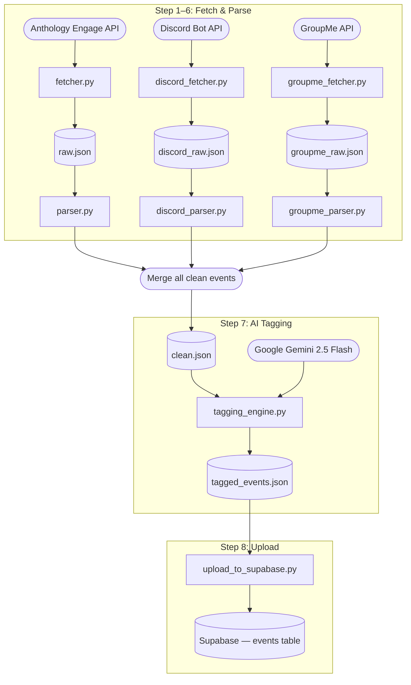

# Data Pipeline

## How The System Works

The pipeline is an 8-step ETL process that runs end-to-end from `run_pipeline.py`. It pulls campus event announcements from three independent sources, normalizes them into a shared schema, tags each event with AI-generated categories, and loads the results into Supabase.

**Step 1 — Fetch Anthology Engage events:** Calls the Rutgers CampusLabs API for upcoming approved events, filtered to those ending after the current UTC time. Raw JSON is saved to `data/raw/raw.json`.

**Step 2 — Parse Anthology events:** Strips HTML from descriptions using BeautifulSoup, parses ISO timestamps, and extracts `title`, `club_name`, `description`, `location`, `date`, `start_time`, and `end_time`. Source is marked `"getinvolved"`. Output goes to `data/clean/clean.json`.

**Step 3 — Fetch Discord announcements:** Authenticates via a bot token and fetches the 25 most recent messages from each configured channel. Handles HTTP 429 rate limits with exponential backoff. Raw messages are saved to `data/raw/discord_raw.json`.

**Step 4 — Parse Discord messages:** Uses regex patterns to extract dates (ISO, slash, written-month, and weekday-relative formats), time ranges, and locations from free-text announcements. Strips markdown formatting and skips bot edit-log messages. Source is marked `"discord"`.

**Step 5 — Fetch GroupMe announcements:** Authenticates via an access token, auto-discovers "Events" sub-channels within each group, and fetches up to 25 messages per group. Rate limiting and per-group failures are handled gracefully. Raw messages saved to `data/raw/groupme_raw.json`.

**Step 6 — Parse GroupMe messages:** Applies the same date/time/location extraction logic as the Discord parser. Unix `created_at` timestamps are converted to Eastern time for resolving weekday-relative references. Source is marked `"groupme"`.

After Steps 1–6, all cleaned events are merged into a single `data/clean/clean.json` and written to disk.

**Step 7 — AI tagging:** Each event is sent to Google Gemini 2.5 Flash with a prompt asking for 3–5 comma-separated category tags (e.g., `"academic, workshop, stem"`). Already-tagged events are skipped by deduplicating on a `title-date` key. Progress is saved after every event so a crash does not lose prior work. When the API quota is exhausted, remaining events fall back to `["general", "campus life"]` tags. Output is `server/tagged_events.json`.

**Step 8 — Upload to Supabase:** Reads `tagged_events.json` and inserts rows into the `events` table. PostgreSQL unique-constraint violations (error `23505`) are caught and counted as duplicates rather than failures. The step prints a summary of new, skipped, and failed counts.

If any fetch step fails, the pipeline falls back to whatever was previously cached on disk for that source and continues — no source failure aborts the run.

---

## Architecture

```
data_pipeline/
├── run_pipeline.py          # Orchestrator — calls all 8 steps in order
├── config.py                # Centralized path constants (raw, clean, tagged)
├── requirements.txt
├── .env                     # API credentials (not committed)
├── scraper/
│   ├── fetcher.py           # Anthology Engage API client
│   ├── parser.py            # Anthology event normalizer
│   ├── discord_fetcher.py   # Discord Bot API client
│   ├── discord_parser.py    # Discord message extractor
│   ├── groupme_fetcher.py   # GroupMe API client
│   └── groupme_parser.py    # GroupMe message extractor
└── data/
    ├── raw/                 # Intermediate: one JSON file per source
    └── clean/               # Intermediate: normalized events per source

server/                      # Shared with the API server
├── tagging_engine.py        # Gemini AI tagger (Step 7)
└── upload_to_supabase.py    # Supabase loader (Step 8)
```

## Mermaid.js chart



**Data flow:**

```
Anthology Engage API ──► raw.json ──► clean.json ──┐
Discord Bot API      ──► discord_raw.json ──► discord_clean.json ──► (merged) clean.json ──► tagged_events.json ──► Supabase
GroupMe API          ──► groupme_raw.json ──► groupme_clean.json ──┘
                                                                         ▲
                                                               Gemini 2.5 Flash
```

**Normalized event schema** (all sources produce this):

| Field | Type | Notes |
|---|---|---|
| `title` | string | Event name |
| `club_name` | string | Hosting organization |
| `description` | string | Plain text, HTML stripped |
| `location` | string | Extracted from text or API field |
| `date` | string | `YYYY-MM-DD` |
| `start_time` | string | `HH:MM` 24-hour |
| `end_time` | string | `HH:MM` 24-hour, may be null |
| `source` | string | `"getinvolved"`, `"discord"`, or `"groupme"` |
| `tags` | list[string] | Added by Step 7 |

**Key design decisions:**
- **In-memory chaining:** Fetchers return data directly to parsers. Disk writes are a fallback for crash recovery, not the primary transport.
- **Incremental tagging:** Tagged events are written after every Gemini call, so the file is always valid JSON on disk.
- **Shared `server/` modules:** `tagging_engine.py` and `upload_to_supabase.py` are also used by the API server, so they live outside `data_pipeline/`.

---

## Getting Started

### Prerequisites

- Python 3.10+
- A Discord bot with message read permissions added to the target channels
- A GroupMe access token with membership in the target groups
- A Google Gemini API key
- A Supabase project with an `events` table

### Installation

```bash
cd data_pipeline
pip install -r requirements.txt
```

### Environment variables

Create `data_pipeline/.env`:

```env
DISCORD_BOT_TOKEN=your_discord_bot_token
DISCORD_CHANNEL_IDS=123456789,987654321

GROUPME_ACCESS_TOKEN=your_groupme_token
GROUPME_GROUP_IDS=11111111,22222222
```

Create a `.env` in the project root (shared with the server):

```env
GEMINI_API_KEY=your_gemini_api_key
SUPABASE_URL=https://your-project.supabase.co
SUPABASE_KEY=your_supabase_anon_key
SUPABASE_SERVICE_ROLE_KEY=your_service_role_key
```

### Running the pipeline

```bash
cd data_pipeline
python run_pipeline.py
```

The pipeline prints progress for each step and exits cleanly. If a single source fails to fetch, it continues with cached data. The final summary from Step 8 shows how many events were inserted, skipped as duplicates, or failed.

### Running on a schedule

A GitHub Actions workflow in `.github/workflows/` runs the pipeline automatically on a weekly cron schedule. To trigger it manually, use the "Run workflow" button in the Actions tab.
